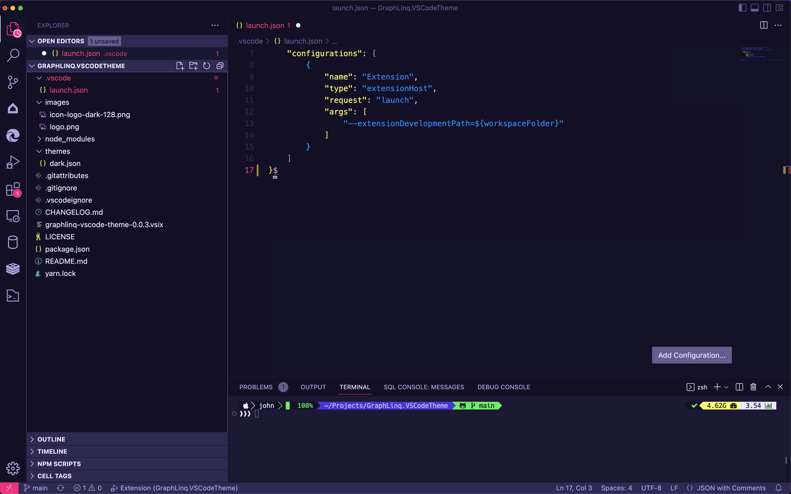
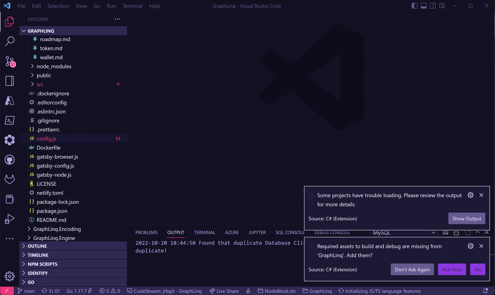

>The no-code protocol for
building on the Blockchain. Automate & perform hundreds of actions based on events triggered on-chain & off-chain.

# GraphLinq Theme for Visual Studio Code

A theme for the no-code community for when they are forced to code.

## Themes

This package contains a dark theme based on the GraphLinq color scheme. To learn more about GraphLinq visit [GraphLinq.io](https://graphlinq.io) and try our no-code IDE.

## Screenshots

## Contributors

###### Made with [contrib.rocks](https://contrib.rocks)
