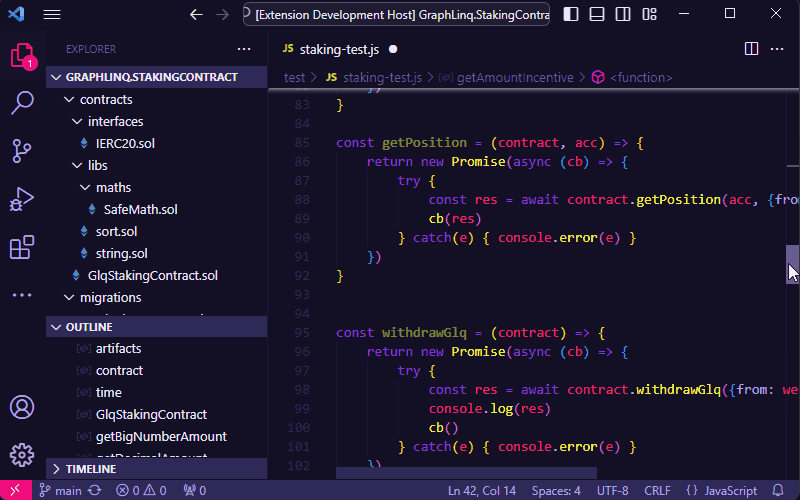
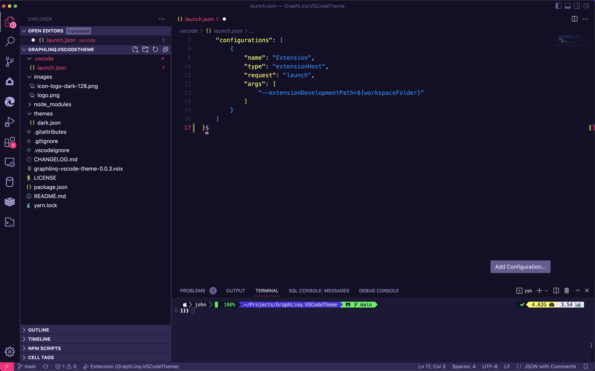
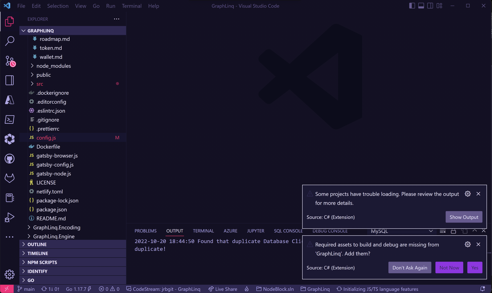

> The no-code blockchain for Web3 Automation & dApps. Automate & perform over hundreds of actions based on events triggered on-chain & off-chain.

# GraphLinq Theme for Visual Studio Code

[](https://marketplace.visualstudio.com/items?itemName=GraphLinq.graphlinq-vscode-theme)
[](https://marketplace.visualstudio.com/items?itemName=GraphLinq.graphlinq-vscode-theme)
[](https://marketplace.visualstudio.com/items?itemName=GraphLinq.graphlinq-vscode-theme)
[](https://github.com/GraphLinq/GraphLinq.VSCodeTheme/releases)

A sleek, modern dark theme for Visual Studio Code featuring the distinctive GraphLinq brand colors. Designed for developers in the no-code community who occasionally need to write code, this theme provides excellent readability and visual consistency across all programming languages.

## ✨ Features

- **🎨 GraphLinq Brand Colors**: Authentic color palette matching GraphLinq's visual identity
- **👁️ Optimized Visibility**: Enhanced contrast for markdown, highlighting, and UI elements
- **🔧 Complete Coverage**: 462 UI color definitions and comprehensive syntax highlighting
- **📝 Markdown Ready**: Special highlighting for bold, italic, code blocks, and quotes
- **⚡ Performance**: Lightweight theme with no performance impact
- **🌙 Dark Theme**: Designed for comfortable coding in low-light environments

## 🚀 Installation

### Via VS Code Marketplace (Recommended)
1. Open Visual Studio Code
2. Go to Extensions view (`Ctrl+Shift+X` or `Cmd+Shift+X`)
3. Search for "GraphLinq Theme"
4. Click "Install"
5. Go to `File > Preferences > Color Theme` and select "GraphLinq Dark"

### Via Command Palette
1. Open Command Palette (`Ctrl+Shift+P` or `Cmd+Shift+P`)
2. Type "Preferences: Color Theme"
3. Select "GraphLinq Dark"

### Manual Installation
Download the latest `.vsix` file from [GitHub Releases](https://github.com/GraphLinq/GraphLinq.VSCodeTheme/releases) and install via:
```bash
code --install-extension graphlinq-vscode-theme-0.1.2.vsix
```

## 🎨 Color Palette

The theme uses GraphLinq's signature colors for a cohesive development experience:

| Element | Color | Hex Code |
|---------|-------|----------|
| Primary Purple |  | `#5029e5` |
| Accent Pink |  | `#ff007a` |
| Bright Pink |  | `#ff286f` |
| Background Dark |  | `#131026` |
| Background Mid |  | `#1c1836` |
| Foreground Light |  | `#ece7fd` |
| Success Green |  | `#05f24f` |
| Warning Yellow |  | `#fdfe54` |

## 📸 Screenshots

### Coding Experience


### Syntax Highlighting


### UI Integration


## 🔄 Recent Updates

### Version 0.1.2 (Latest) - Critical Fixes
- **🔥 Critical**: Fixed markdown highlighting visibility
- **🔥 Critical**: Fixed warning icon colors for better visibility
- Enhanced find/match highlighting with improved contrast
- Added comprehensive markdown syntax highlighting
- Fixed scrollbar styling for dark theme consistency

### Version 0.1.1 - Development Improvements
- Added WARP.md for AI development assistance
- Updated build toolchain to modern @vscode/vsce
- Added automated release scripts
- Enhanced development workflow

[View All Releases](https://github.com/GraphLinq/GraphLinq.VSCodeTheme/releases)

## 🛠️ Development

This theme is built with a modern development workflow including automated releases and comprehensive documentation.

### Contributing
1. Fork the repository
2. Create a feature branch
3. Make your changes to `themes/dark.json`
4. Test locally: `npm run test-local`
5. Submit a pull request

### Building Locally
```bash
npm install
npm run package
npm run install-local
```

## 🌐 GraphLinq Ecosystem

Learn more about GraphLinq and explore our no-code blockchain platform:
- **Website**: [GraphLinq.io](https://graphlinq.io)
- **Documentation**: [docs.graphlinq.io](https://docs.graphlinq.io)
- **Community**: [Discord](https://discord.gg/graphlinq)
- **GitHub**: [GraphLinq Organization](https://github.com/GraphLinq)

## 📊 Stats

- **Downloads**: 626+ installs
- **Rating**: ⭐⭐⭐⭐⭐ (5.0/5.0)
- **Support**: All VS Code versions 1.61.0+
- **Languages**: Universal syntax highlighting

## 📄 License

MIT License - see [LICENSE](LICENSE) file for details.

## 🤝 Contributors

<a href="https://github.com/GraphLinq/GraphLinq.VSCodeTheme/graphs/contributors">
  
</a>

---

**Made with ❤️ by the GraphLinq team**

[Report Issues](https://github.com/GraphLinq/GraphLinq.VSCodeTheme/issues) • [Request Features](https://github.com/GraphLinq/GraphLinq.VSCodeTheme/issues/new) • [View Marketplace](https://marketplace.visualstudio.com/items?itemName=GraphLinq.graphlinq-vscode-theme)
